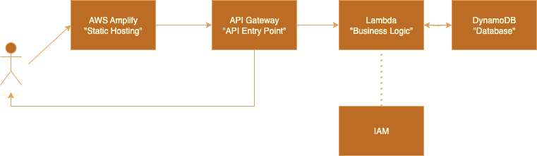

# AWS-ProjectArchitect-Build-an-End-to-End-AWS-Web-Application

## Architecture



```mermaid
flowchart LR
    U[User (Browser)] -->|"Request: HTML, JS, CSS"| A[AWS Amplify]
    A -->|"API call (fetch POST/GET)"| G[API Gateway]
    G -->|"Invoke"| L[Lambda Function]
    L <-->|"Read/Write"| D[(DynamoDB)]
    L -->|"IAM Role"| I[IAM Permissions]
    L -->|"JSON Response"| G
    G -->|"Response to Client"| U
